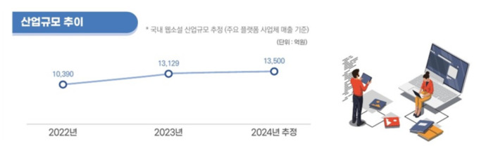
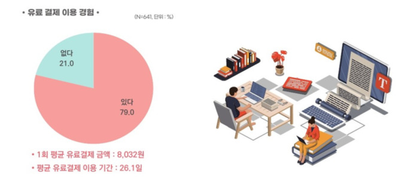
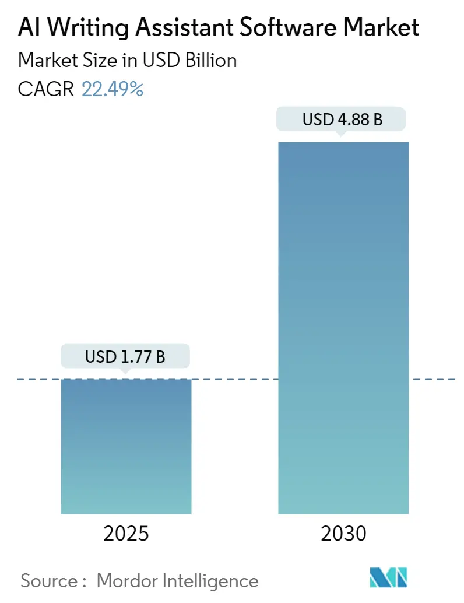

# 시장 분석

---

## 기존 방식과의 차별성 및 혁신요소

- **기존에는** 장편 연재 작가가 수백 화 분량의 설정을 모두 기억에 의존해 관리하였고, 오류는 원고 발행 후 독자 댓글을 통해서만 사후 인지할 수 있었다(Context Decay 문제). 또한 기존 문서 편집기나 단순 키워드 검색은 사건-인물-배경 간의 인과관계(Causality)를 파악하지 못해 복합적 설정 충돌을 잡아낼 수 없었다. **본 서비스는** 원고 텍스트를 자동 해체·분석하여 인과관계가 맵핑된 지식 그래프(Knowledge Graph)를 구축하고, 신규 에피소드 업로드 즉시 기존 세계관과 대조하는 RAG 파이프라인을 통해 설정 충돌을 **집필 전에 선제적으로 감지(Smart Authoring Environment)**함으로써 사후 대응 구조를 근본적으로 탈피한다.
- **기존에는** 경쟁 서비스(Sudowrite Story Bible, NovelCrafter Codex 등)가 작가의 수동 입력에 전적으로 의존하여 세계관 데이터를 구성하였고, 설정 변경(레트콘) 시 과거 연재분 전체에 미치는 파급 효과를 자동으로 추적하는 기능이 전무하였다. **본 서비스는** 레트콘 강행 시 Kafka 기반 이벤트 주도 아키텍처(EDA)가 비동기로 양방향 역추적을 수행하여 "수정이 필요한 과거 에피소드 리스트"를 리포트 형태로 자동 제안하는 업계 최초의 Ripple Effect 추적 기능을 제공한다.
- **핵심 혁신 포인트:** 단순 설정 검사기가 아닌 소설 세계관을 완전히 이해하는 'AI 코어 엔진'을 선점함으로써, 향후 장르별 템플릿 마켓·인터랙티브 RAG 검색·플롯 보조 등 파생 기능을 이 엔진에 연결하는 수준으로 무한히 확장 가능한 스토리 엔지니어링 플랫폼을 구축한다.

---

## 시장 동향

- 글로벌 웹소설 플랫폼 시장은 2024년 **42억 달러(약 5조 8천억 원)** 규모를 기록했으며, 2033년까지 **123억 달러(약 17조 원)** 규모로 성장할 전망이다. 연평균 성장률(CAGR)은 **12.8%**로, 모바일 접근성 확대와 구독 기반 수익 모델의 안착이 주된 성장 동인이다. (Valuates Reports, *Global Web Novel Platforms Market*, 2025)
- 아시아-태평양 지역은 2025년 기준 전 세계 웹소설 시장의 **54.3%**를 차지하는 지배적 시장이며, CAGR **13.1%**로 성장세를 유지하고 있다. (Valuates Reports, 2025)
- 국내 시장에서는 한국출판문화산업진흥원의 「2024년 웹소설 산업 현황 실태조사」에 따르면, 국내 웹소설 시장 규모는 **1조 3,500억 원**으로 집계되었으며, 2025년에는 **2조 원** 규모에 근접할 것으로 전망된다. 이용자의 **79%**가 유료 결제 경험을 보유하고 있어 높은 수익화 가능성을 시사한다.

*출처: 뉴스핌 (한국출판문화산업진흥원 「2024년 웹소설 산업 현황 실태조사」 인용), 2025*

*출처: 뉴스핌 (한국출판문화산업진흥원 「2024년 웹소설 산업 현황 실태조사」 인용), 2025*

- AI 글쓰기 어시스턴트 소프트웨어 시장은 2025년 **62억 달러(약 8조 6천억 원)** 규모로 평가되며, 2034년까지 **284억 달러(약 39조 원)** 규모로 확대될 전망이다. CAGR **18.4%**의 고성장 시장으로, 생성형 AI의 대중화와 콘텐츠 자동화 수요 증가가 핵심 배경이다. (Verified Market Research, *AI Writing Assistant Software Market*, 2025)

*출처: Mordor Intelligence, AI Writing Assistant Software Market, 2025*
- 장편 연재 특성상 회차가 누적될수록 심화되는 Context Decay(설정 붕괴) 문제는 작품 신뢰도를 직접 저해하는 핵심 페인 포인트로, 일관성 관리(Consistency Management)와 세계관 추적(Worldbuilding Tracking)을 자동화하는 솔루션에 대한 시장 니즈가 지속적으로 확대되고 있다.

---

## 경쟁 서비스

| 구분 | 서비스명 | 유형 | 핵심 특징 |
|------|---------|------|-----------|
| 국내 경쟁사 1 | 노벨라(Novela) | 웹소설 특화 워드 프로세서 | 캐릭터·플롯 설정 통합 관리, 2025년 AI 기능 추가 유료화 전환 |
| 국내 경쟁사 2 | 스코웍스 스토리체인 | AI 웹소설 창작 보조 | 인물 설정 기반 AI 아이디어 제안, 에피소드 데이터 학습 |
| 국내 경쟁사 3 | 스토리피아 | 웹소설 생성·창작 플랫폼 | AI 생성 기능 내장, 2024년 공식 론칭 |
| 글로벌 경쟁사 1 | Sudowrite | AI 소설 창작 어시스턴트 | Story Bible로 설정 문서 수동 관리, 산문 품질 특화 |
| 글로벌 경쟁사 2 | NovelCrafter | 구조 기반 소설 작성 도구 | Codex(세계관 DB)를 AI 생성에 참조, 작가 직접 입력 필요 |
| 글로벌 경쟁사 3 | Novarrium | 장편 일관성 검증 특화 도구 | Logic-Locking으로 모순 사전 방지·검증, 20화 이상 장편 최적화 |
| 글로벌 경쟁사 4 | WorldAnvil | 세계관 빌딩 위키 | 관계도·위키 형식의 설정집 구축, 창작 협업 지원 |

---

## 차별화 요소

### 1. 설정 관리 방식: 수동 입력 vs. 자동 지식 그래프 구축

- **경쟁사(Sudowrite, NovelCrafter, WorldAnvil 등)**: 작가가 캐릭터·설정·세계관 정보를 직접 입력·분류해야 Codex 또는 Story Bible이 완성된다. 초기 등록 공수가 크고, 신규 회차 추가 시 설정 갱신도 수동으로 이루어진다.
- **본 서비스**: 기존 연재 원고를 일괄 업로드하면 LLM Wiki 패턴 기반 파이프라인이 인물·사건·배경 간의 인과관계를 자동 추출해 **지식 그래프(Knowledge Graph)**를 구축한다. → 수백 화 분량의 기존 연재물을 보유한 중·장기 작가가 진입 장벽 없이 즉시 활용 가능

### 2. 충돌 감지 시점: 사후 독자 피드백 vs. 집필 전 선제 감지

- **경쟁사**: 단순 텍스트 검색·설정 참조 기능만 제공하며, 사건-인물-배경 간 인과관계를 파악하지 못해 복합적 설정 충돌을 자동으로 잡아낼 수 없다. 작가가 직접 설정을 확인하거나 독자 댓글을 통해 사후에 오류를 인지하는 구조다.
- **본 서비스**: 신규 에피소드 업로드 즉시 하이브리드 RAG 파이프라인(Elasticsearch 키워드 검색 → 빠른 요약 정보 도출 / WAS 인과관계 추론 → 상세 객체 조합)이 기존 세계관과 대조하여 **모순을 사전 경고(Smart Authoring Environment)**한다. → 작품 신뢰도 손상 이전에 오류를 차단하는 유일한 선제적(Proactive) 솔루션

### 3. 레트콘 대응: 단순 수정 안내 vs. 양방향 파급 효과 역추적

- **경쟁사(Novarrium 포함)**: 기존 규칙과의 충돌을 감지하거나 모순 발생을 방지하는 수준에 그친다. 레트콘(설정 강제 변경) 결정 시 과거 연재분 전체에 미치는 파급 효과를 자동으로 역추적해 수정 대상을 제시하는 기능은 없다.
- **본 서비스**: 레트콘 강행 시 Kafka 기반 이벤트 주도 아키텍처(EDA)가 비동기로 양방향 역추적을 수행하여 **"수정이 필요한 과거 에피소드 리스트"를 리포트 형태로** 자동 제안한다. → 업계 유일의 Ripple Effect 추적 기능

### 4. 장르 특화 깊이: 영미권 범용 vs. 한국 장르 소설 특화

- **경쟁사(글로벌)**: Sudowrite, NovelCrafter 등 글로벌 도구는 영미권 소설 구조(3막 구조, 캐릭터 아크 등) 중심으로 설계되어, 무협의 문파·무공 경지나 판타지의 마법 서클·영지 설정 등 한국 장르 소설 특유의 설정 체계를 지원하지 않는다.
- **본 서비스**: 무협·판타지 등 **장르별 유료 템플릿 마켓**을 통해 초보 작가도 한국 장르 소설 규칙에 맞는 설정집을 빠르게 구축하고, AI가 해당 장르 문법에 맞는 가이드를 제공한다. → 국내 1조 3,500억 원 규모 웹소설 시장을 직접 겨냥한 로컬라이즈드 솔루션

---

## 개발 타당성

국내 웹소설 시장이 2024년 1조 3,500억 원을 기록하고 2025년 2조 원 돌파가 전망되는 고성장 시장에서, 글로벌 경쟁사 Sudowrite가 이미 **10만 명 이상**의 작가 유료 구독자를 확보하고 있다는 사실은 소설 창작 도구에 대한 실질적 지불 의사가 시장에 존재함을 직접 증명한다. (Sudowrite, 2025) 국내 웹소설 작가들 역시 웹소설 수입이 전체 소득의 평균 **60.3%**를 차지할 만큼 창작에 전문적으로 의존하고 있어(한국출판문화산업진흥원, 「2024년 웹소설 산업 현황 실태조사」, 2025), 집필 오류를 줄이고 생산성을 높이는 도구에 대한 투자 동기가 명확하다. 글로벌 경쟁사(Sudowrite, NovelCrafter, Novarrium 등)는 모두 영미권 소설 구조 중심의 범용 도구로, 국내 장르 소설 특화 및 Context Decay 문제를 인과관계 기반으로 해결하는 솔루션은 시장에 부재하여 명확한 진입 공백이 존재한다. MVP(설정 충돌 선제 감지) 단계에서 리텐션을 확보한 후, 동일 Knowledge Graph 엔진 위에 장르 템플릿 마켓(수익 모델 1)과 인터랙티브 RAG 검색(수익 모델 2)을 순차 확장하는 구조로 지속 가능한 비즈니스 모델이 설계되어 있다.

---

## 출처

| 자료 | 기관 / 보고서명 | 발행연도 | URL |
|------|--------------|---------|-----|
| 글로벌 웹소설 플랫폼 시장 규모 및 CAGR | Valuates Reports, *Global Web Novel Platforms Market* | 2025 | [링크](https://reports.valuates.com/market-reports/QYRE-Auto-20P16501/global-web-fiction-platforms) |
| 아시아-태평양 시장 점유율 54.3% | Valuates Reports (Yahoo Finance 보도) | 2025 | [링크](https://finance.yahoo.com/news/global-novel-market-reach-usd-142100652.html) |
| 국내 웹소설 시장 규모 1조 3,500억 원 | 한국출판문화산업진흥원, 「2024년 웹소설 산업 현황 실태조사」 | 2025 | [링크](https://www.kpipa.or.kr/p/g3_1/143) |
| 웹소설 이용자 유료 결제 경험 79% | 뉴스핌 (한국출판문화산업진흥원 인용) | 2025 | [링크](https://www.newspim.com/news/view/20250416000768) |
| AI 글쓰기 어시스턴트 시장 규모 및 CAGR 18.4% | Verified Market Research, *AI Writing Assistant Software Market* | 2025 | [링크](https://www.verifiedmarketresearch.com/product/ai-writing-tool-market/) |
| Sudowrite, NovelCrafter, Novarrium 서비스 특징 | mylifenote.ai, *Best AI for Writing Fiction 2026* | 2026 | [링크](https://blog.mylifenote.ai/the-11-best-ai-tools-for-writing-fiction-in-2026/) |
| 노벨라(Novela) 서비스 특징 | 위클리툰, 「웹툰·웹소설의 급격한 성장, 서서히 드러나는 위기」 | 2024 | [링크](https://www.weeklytoon.com/news/articleView.html?idxno=998) |
| 스코웍스 스토리체인 AI 어시스턴트 출시 | ZDNet Korea | 2024 | [링크](https://zdnet.co.kr/view/?no=20240220224140) |
| Sudowrite 10만 명 이상 작가 구독자 | Sudowrite 공식 블로그 | 2025 | [링크](https://sudowrite.com/blog/sudowrite-your-ultimate-ai-partner-for-novel-writing-and-a-look-at-novelcrafter/) |
| 웹소설 작가 수입 의존도 60.3% | 서울경제 (한국출판문화산업진흥원 「2024년 웹소설 산업 현황 실태조사」 인용) | 2025 | [링크](https://www.sedaily.com/NewsView/2GRJLPFP4W) |

---

## 다운로드된 이미지

| 파일명 | 내용 | 출처 | 삽입 위치 |
|--------|------|------|-----------|
| `images/korean-webnovel-market-trend-2024.jpg` | 국내 웹소설 산업 규모 추이 (2021~2024) | 뉴스핌 (한국출판문화산업진흥원 「2024년 웹소설 산업 현황 실태조사」 인용), 2025 | 시장 동향 섹션 |
| `images/korean-webnovel-paid-experience-2024.jpg` | 웹소설 이용자 유료 결제 이용 경험 비율 | 뉴스핌 (한국출판문화산업진흥원 「2024년 웹소설 산업 현황 실태조사」 인용), 2025 | 시장 동향 섹션 |
| `images/ai-writing-market-summary-2025.webp` | AI 글쓰기 어시스턴트 소프트웨어 시장 규모 및 전망 | Mordor Intelligence, AI Writing Assistant Software Market, 2025 | 시장 동향 섹션 |

---

# [Word 원문 버전]

## 시장 분석

글로벌 웹소설 플랫폼 시장은 2024년 약 42억 달러(한화 약 5조 8천억 원) 규모를 기록하였으며 2033년까지 123억 달러(약 17조 원) 규모로 확대될 것으로 전망된다. 연평균 성장률(CAGR)은 12.8%로, 스마트폰 보급 확산에 따른 모바일 접근성 향상과 구독 기반 수익 모델의 안착이 주요 성장 동인이다(Valuates Reports, Global Web Novel Platforms Market, 2025). 특히 아시아-태평양 지역은 2025년 기준 전 세계 웹소설 시장의 54.3%를 점유하는 지배적 시장으로, CAGR 13.1%로 성장세를 이어가고 있다. 국내 시장 역시 한국출판문화산업진흥원의 2024년 웹소설 산업 현황 실태조사에 따르면 국내 웹소설 시장 규모는 1조 3,500억 원을 기록하였으며 2025년에는 2조 원 규모에 근접할 것으로 예상된다. 이용자의 79%가 유료 결제 경험을 보유하고 있다는 점은 높은 수익화 가능성을 뒷받침한다.

[이미지 삽입: 국내 웹소설 산업 규모 추이 그래프 (2021~2024) — 파일명: images/korean-webnovel-market-trend-2024.jpg / 출처: 뉴스핌 (한국출판문화산업진흥원 「2024년 웹소설 산업 현황 실태조사」 인용), 2025]

[이미지 삽입: 웹소설 이용자 유료 결제 이용 경험 비율 — 파일명: images/korean-webnovel-paid-experience-2024.jpg / 출처: 뉴스핌 (한국출판문화산업진흥원 「2024년 웹소설 산업 현황 실태조사」 인용), 2025]

한편 AI 글쓰기 어시스턴트 소프트웨어 시장은 2025년 약 62억 달러(약 8조 6천억 원) 규모로 평가되며 2034년까지 284억 달러(약 39조 원) 규모로 성장할 전망이다. 연평균 성장률 18.4%로 고성장 중인 이 시장은 생성형 AI의 대중화와 콘텐츠 자동화 수요 증가가 주된 배경을 이루고 있다(Verified Market Research, AI Writing Assistant Software Market, 2025).

[이미지 삽입: AI 글쓰기 어시스턴트 소프트웨어 시장 규모 및 전망 — 파일명: images/ai-writing-market-summary-2025.webp / 출처: Mordor Intelligence, AI Writing Assistant Software Market, 2025]

경쟁 서비스 현황을 살펴보면, 국내에서는 노벨라(Novela), 스코웍스의 스토리체인, 스토리피아 등이 AI 창작 보조 도구 시장에 진입해 있다. 노벨라는 한국 웹소설 연재에 특화된 워드 프로세서로 캐릭터와 플롯 설정을 통합 관리하며 2025년 AI 기능 추가와 함께 유료화로 전환하였고, 스코웍스 스토리체인은 인물 설정 기반의 AI 아이디어 제안 기능을 탑재해 2024년 출시되었다. 글로벌 시장에서는 Sudowrite, NovelCrafter, Novarrium, WorldAnvil 등이 주요 경쟁자로 부상해 있다. Sudowrite는 Story Bible을 통한 설정 문서 수동 관리 기능을 제공하며, NovelCrafter는 Codex라는 구조화된 세계관 데이터베이스를 AI 생성에 참조하는 방식을 채택하고 있다. Novarrium은 Logic-Locking 시스템으로 20화 이상 장편에서의 모순 방지를 특화로 내세우고 있다.

본 서비스의 차별화 포인트는 크게 네 가지 축에서 경쟁 우위를 확보한다. 첫째, 설정 관리 방식이다. 기존 경쟁 서비스들은 작가가 캐릭터, 설정, 세계관 정보를 직접 수동으로 입력해야 하는 구조로 초기 등록 공수가 크다. 반면 본 서비스는 기존 연재 원고를 일괄 업로드하면 LLM Wiki 패턴 기반 파이프라인이 인물, 사건, 배경 간의 인과관계를 자동 추출하여 지식 그래프를 구축하므로, 수백 화 분량의 기존 연재물을 보유한 작가가 진입 장벽 없이 즉시 활용할 수 있다. 둘째, 충돌 감지 시점이다. 대부분의 경쟁 도구는 단순 텍스트 검색 수준에 머물러 인과관계 기반의 복합적 설정 충돌을 자동으로 잡아내지 못한다. 본 서비스는 신규 에피소드 업로드 즉시 하이브리드 RAG 파이프라인(Elasticsearch 키워드 검색과 WAS 인과관계 추론의 조합)이 기존 세계관과 대조하여 모순을 사전 경고함으로써 작품 신뢰도 손상 이전에 오류를 차단하는 선제적 솔루션을 제공한다. 셋째, 레트콘 대응 역량이다. 기존 경쟁사들은 모순 발생을 방지하는 수준에 그치며, 레트콘 결정 시 과거 연재분 전체에 미치는 파급 효과를 자동으로 역추적하는 기능은 어떤 경쟁사도 제공하지 않는다. 본 서비스는 Kafka 기반 이벤트 주도 아키텍처가 비동기로 파급 효과 역추적 리포트를 생성하며 수정이 필요한 과거 에피소드 리스트를 자동으로 제안하는 업계 유일의 양방향 Ripple Effect 추적 기능을 갖는다. 넷째, 한국 장르 소설 특화다. 글로벌 경쟁 도구들은 영미권 소설 구조 중심으로 설계되어 무협의 문파, 무공 경지나 판타지의 마법 서클, 영지 설정 등 한국 장르 소설 특유의 설정 체계를 지원하지 않는다. 본 서비스는 장르별 유료 템플릿 마켓을 통해 초보 작가도 한국 장르 소설 규칙에 맞는 설정집을 빠르게 구축할 수 있도록 지원하며, 국내 1조 3,500억 원 규모의 웹소설 시장을 직접 겨냥한 로컬라이즈드 솔루션을 실현한다.

개발 타당성 측면에서, 국내 웹소설 시장이 2024년 1조 3,500억 원을 기록하고 2025년 2조 원 돌파가 전망되는 고성장 시장에서 글로벌 경쟁사 Sudowrite가 이미 10만 명 이상의 작가 유료 구독자를 확보하고 있다는 사실은 소설 창작 도구에 대한 실질적 지불 의사가 시장에 존재함을 직접 증명한다(Sudowrite, 2025). 국내 웹소설 작가들 역시 웹소설 수입이 전체 소득의 평균 60.3%를 차지할 만큼 창작에 전문적으로 의존하고 있어(한국출판문화산업진흥원, 2024년 웹소설 산업 현황 실태조사, 2025), 집필 오류를 줄이고 생산성을 높이는 도구에 대한 투자 동기가 명확하다. 글로벌 경쟁사들이 모두 영미권 범용 도구에 그쳐 Context Decay(장편 연재 누적에 따른 설정 붕괴) 문제를 인과관계 기반으로 해결하는 솔루션이 시장에 부재하여 명확한 진입 공백이 존재하며, MVP 단계에서 리텐션을 확보한 후 동일 Knowledge Graph 엔진 위에 장르 템플릿 마켓과 인터랙티브 RAG 검색을 순차 확장하는 구조로 지속 가능한 비즈니스 모델이 설계되어 있다.
